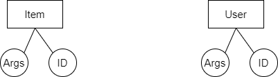
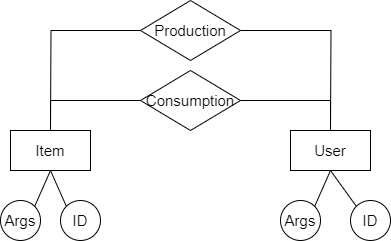
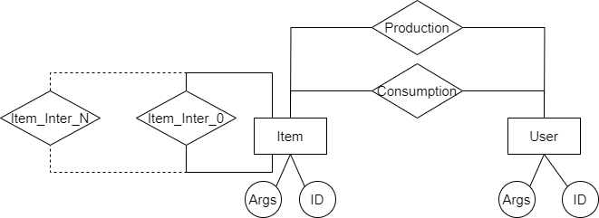
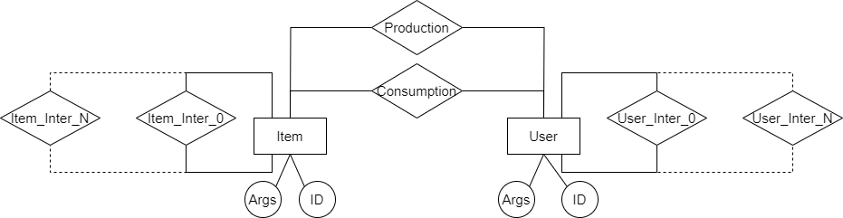

# GRS

## Structure

A Generic Recommendation System is being implemented, the class structure used at this time consists of Items and Users. Both classes will have an identifier and a variable number of arguments since the items and the way of storing them in a database may differ between recommendation systems.

To begin the modeling of Collaborative Filtering, the Consumption and Production interrelationships are created between these classes, in which a user is related to an item or set of items. In principle there are multiple possible interactions that can be modeled and will be received as arguments, but the most common interactions such as comments and ratings were separated for convenience.

It must be taken into account that users do not need to consume or produce content to be in the database (an example of why this is possible will be discussed later) and that the content does not need to be created or consumed by any user to be in the database eather, so you can perfectly hide items or delete creation records and this should not interfere with the recommendation process.

To model Content-Based Filtering between items that can represent different items (as in the case of virtual stores), it was necessary to find search spaces in which said items can be compared, given that the main problem that comparing very different items would bring would be the variability between stored arguments. To solve this, the option of inheriting from the Items class and creating new classes for each item was analyzed, but then there was the problem of relating items of different classes and organizing a set of classes that can be as large as the system allows. The option that is planned to be used is to create multiple relationships at runtime, relying on LLM to define when it is necessary to create a new relationship between Items.

With this solution, the relationships between items and search spaces are resolved, since interrelationships can be created that define that certain objects under a certain problem belong to the same search space. The problem here is the dependency and the need for a good result from the LLM for modeling, since information will be stored in the interrelation that defines the situation it models and an LLM has to receive a new set of objects and define if it can be modeled with any of the interrelationships that exist so far or not.

Then there was the problem of social networks and their recommendation of users where they used both Content-Based Filtering and Collaborative Filtering, using family relationships used on Facebook, contact information from other applications and even Instagram that uses contacts from your number record. It is proposed to use the same modeling as to resolve the relationships between Items, but in this case for Users.

When arriving at this modeling, the option of having a single class with multiple interrelationships with itself was analyzed given that the recommendation systems could recommend both entities and were based on interrelationships that could be modeled at runtime as is currently the case. It was decided not to do this given that the possible interrelationships between Users can have a very different perspective than the interrelationships between Items and change at a much greater speed, so this idea was rejected despite further abstracting the concept.
